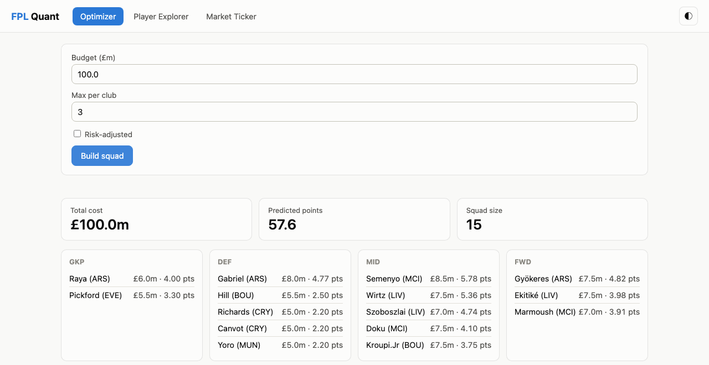
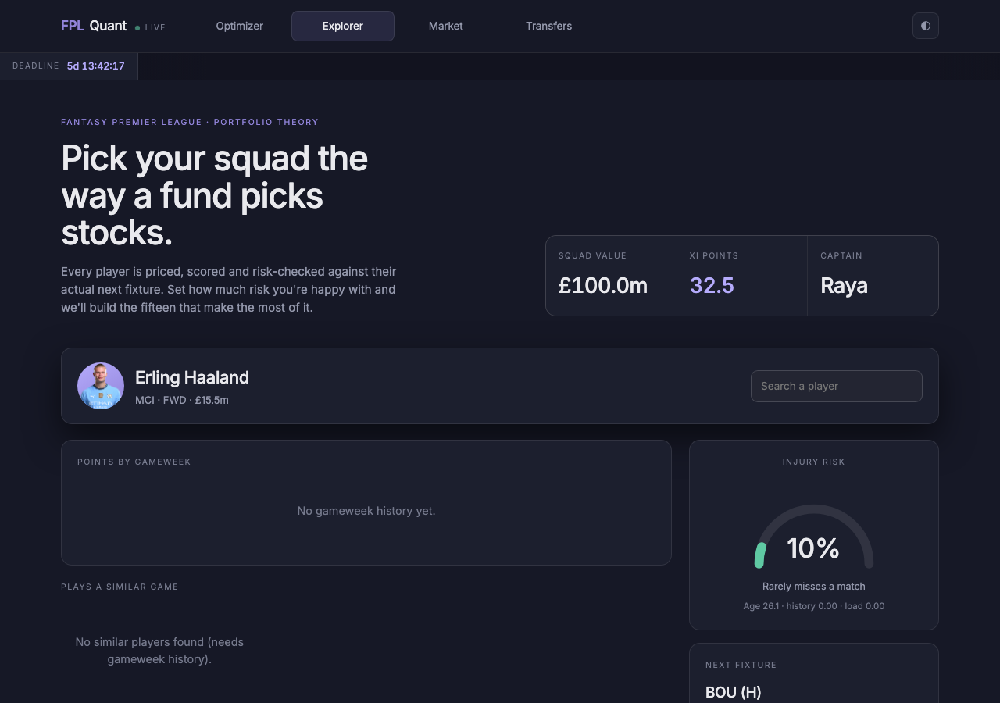
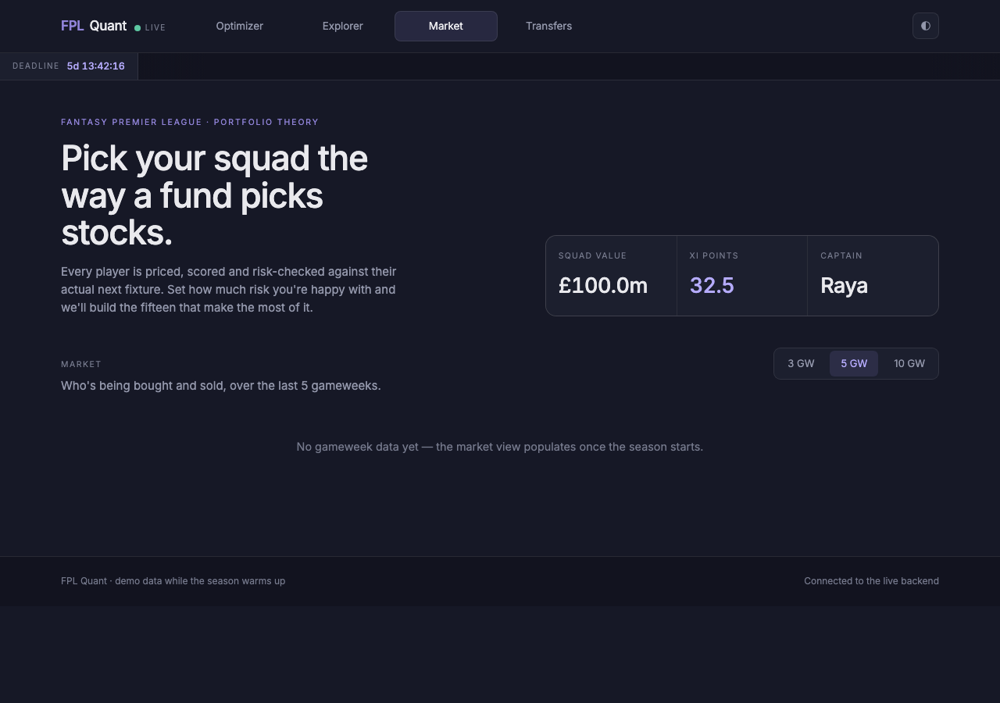
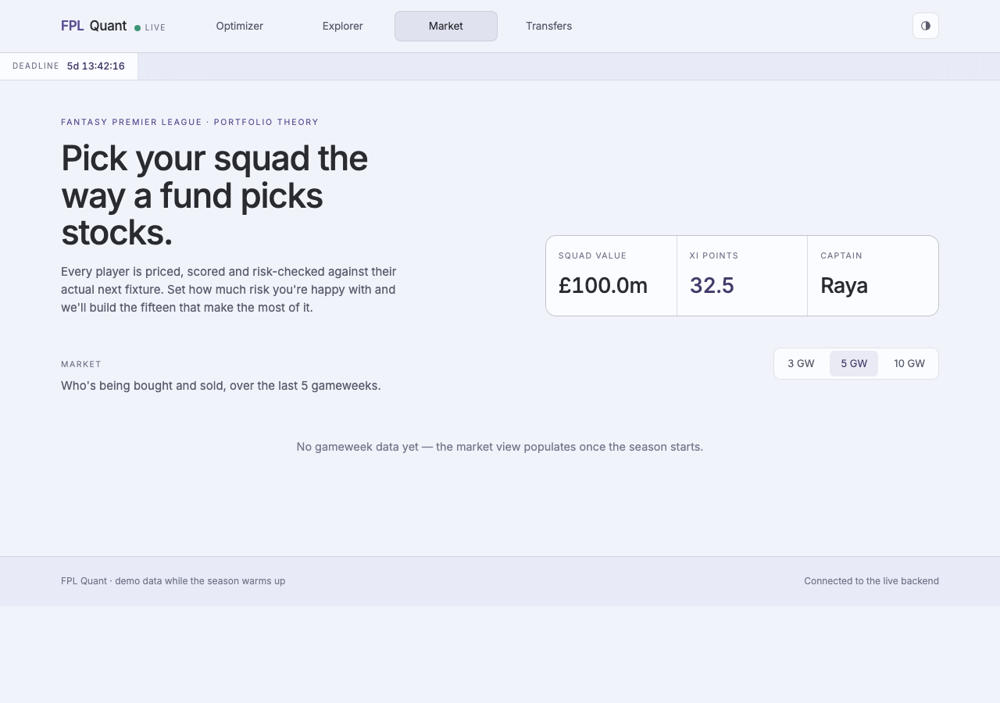

# FPL Quant

[](https://github.com/SidharthJoly/FPLQuant/actions/workflows/ci.yml)
[](https://github.com/SidharthJoly/FPLQuant/actions/workflows/ci.yml)

A Fantasy Premier League analytics and squad optimization platform. Treats players
like financial instruments — combining price momentum, volatility, and portfolio
theory with real sports analytics (injury risk, form) to select an optimal,
risk-adjusted squad.

## Status

✅ All 10 planned milestones are in place, and it's live:
**[fplquant.sidharthjoly.com](https://fplquant.sidharthjoly.com/)**
(frontend, GitHub Pages behind a custom subdomain) talking to a real backend
on an Oracle Cloud Always Free VM at `https://fplquant.duckdns.org` (see
[`DEPLOYMENT.md`](DEPLOYMENT.md)).

## Screenshots

Squad optimizer, player explorer, and the market view — the "Nocturne" quant-terminal
redesign, dark by default with a light-mode variant. Player positions in the
optimizer's starting-XI pitch view are jersey icons colored by each club's real kit.
**Demo data** — the 2026/27 season hasn't started yet, so these are
seeded with synthetic gameweek history on top of real FPL player/team data,
not live results.






## Architecture (current)

```
FPL API (fantasy.premierleague.com/api)
        │
        ▼
FPLClient (src/fplquant/data/fpl_client.py)   — HTTP wrapper, retries
        │
        ▼
ingest.py (src/fplquant/data/ingest.py)       — upserts into ORM models
        │
        ▼
SQLAlchemy ORM (src/fplquant/models/orm.py)   — Team, Player, Fixture,
        │                                        PlayerGameweekStat
        ▼
SQLite (data/fplquant.db), schema managed by Alembic (alembic/)

Transfermarkt (transfermarkt.com)
        │
        ▼
TransfermarktClient (src/fplquant/data/transfermarkt_client.py) — scrapes
        │                                     player search + injury history
        ▼
player_matching.py                    — fuzzy name+club matching to FPL players
        │
        ▼
ingest_injuries.py                    — caches the match, syncs InjuryRecord rows
```

Two scheduled GitHub Actions workflows keep the database fresh:
- `.github/workflows/ingest.yml` — daily, pulls prices/points/fixtures from the FPL API
- `.github/workflows/ingest_injuries.yml` — weekly, resolves + syncs Transfermarkt
  injury history (lower frequency since it's rate-limited scraping over the full
  player pool)

Both upload the resulting SQLite database as a build artifact.

```
FastAPI app (src/fplquant/api/main.py)
        ├── /players, /players/{id}, /players/{id}/similar
        ├── /form, /risk
        ├── /market/momentum, /market/volatility, /market/correlation
        ├── /optimize  ── cached in Redis (api/cache.py), keyed on request params
        └── /transfers/plan  ── see "Fixture-adjusted predictions & transfer planner" below
```

All read endpoints query the same SQLite database and reuse the exact same
scoring/optimizer modules as the CLIs — the API is a thin HTTP layer over
them, not a separate implementation. `/optimize` is the one expensive
computation (an ILP solve, plus — for risk-adjusted requests — the
form/volatility/injury-risk pipelines), so it's the one endpoint that's
cached; the cache degrades gracefully (falls through to a fresh computation,
logging a warning) if Redis is unreachable rather than ever failing a request.

```
frontend/ (static, no build step — no Node/npm involved)
  index.html   ── 4 tabs: Optimizer, Explorer, Market, Transfers, plus a
                  persistent header (nav, live deadline countdown, price/
                  ownership ticker tape) and a squad-summary hero
  config.js    ── API_BASE: same-origin locally, the backend's URL once deployed
  api.js       ── fetch wrapper over the endpoints above
  kits.js      ── real home-kit colors per club, for the jersey icons
  components.js ── jersey icon (SVG), donut gauge, fixture-context meta line
  optimizer.js / explorer.js / ticker.js / transfers.js / main.js
```

The design — "Nocturne", a dark-first quant-terminal aesthetic — was built in
Claude's design tool and imported via the `claude_design` MCP, then
implemented against the real API (not the mock data the design tool preview
used). The starting-XI pitch view positions players by formation row with
jersey icons in each club's real kit colors; the header's ticker tape and
deadline countdown are driven by `/market/momentum` and the new
`/meta/next-deadline` endpoint.

### Fixture-adjusted predictions & transfer planner

Every predicted-points number in the app — the optimizer, the starting XI's
bench/start and captain choices, and the transfer planner — is fixture-adjusted
for each player's *next match specifically* (`src/fplquant/form/fixtures.py`),
not just a season-long average:

- **Opponent strength**: a continuous multiplier (clamped 0.7–1.3) built from
  each team's own attack/defence ratings, position-aware — GKP/DEF care about
  the opponent's attacking strength (clean sheet odds), MID/FWD care about the
  opponent's defensive strength — plus FPL's own 1–5 fixture difficulty rating
  surfaced alongside it for display.
- **Venue**: home/away, since those ratings differ by venue.
- **Chance of playing**: FPL's own `chance_of_playing_next_round` when set
  (press-conference news), else inferred from `status`.

This feeds the risk-adjusted scorer too (`src/fplquant/risk/adjusted.py`), so
"risk-adjusted" and "fixture-adjusted" compose rather than compete.

The **transfer planner** (`src/fplquant/transfers/`) pulls a manager's current
squad from their public FPL team ID — no login needed, the same data FPL's own
site shows on a manager's profile — and solves an ILP (`propose_transfers`,
extending the same PuLP formulation as the squad optimizer) for the transfers
that maximize next-match expected points *net of the real -4-per-transfer hit*
beyond the manager's free transfers. Because making no transfers is always a
free, feasible option, a transfer is only ever recommended when its expected
gain outweighs its cost — "is this transfer worth the hit" is answered by the
optimization itself, not a separate heuristic. Wildcard/Free Hit chips are
supported (they lift the transfer limit and the hit entirely for that
gameweek). Sell price is approximated as current market value, since FPL's
sell-on-fee data isn't available without authenticating as the manager.

Note: FPL only exposes a manager's picks once their first gameweek deadline
has passed, so the transfer planner has nothing to plan from until then — it
returns a clear "season hasn't started yet" message rather than an error in
that case.

Two ways to serve it, both supported:
- **Local / same-origin:** FastAPI mounts `frontend/` itself (`StaticFiles` at
  `/`, after all API routes) — no CORS needed, `config.js`'s default
  `API_BASE = ""` just works.
- **Deployed:** the frontend is published to **GitHub Pages**
  (`.github/workflows/pages.yml`, triggered on any push touching `frontend/`)
  while the backend runs separately on the droplet — genuine cross-origin
  traffic. `config.js`'s `API_BASE` needs to point at the droplet's URL, and
  `Settings.cors_allowed_origins` (`src/fplquant/config.py`) needs the Pages
  origin allowed — it already defaults to `https://fplquant.sidharthjoly.com`
  (the custom subdomain the site runs on) plus `https://sidharthjoly.github.io`
  and localhost, override via `FPLQUANT_CORS_ALLOWED_ORIGINS` if that ever
  changes.

Vanilla HTML/CSS/JS by design: no bundler, no framework, no `npm install`.

## Project layout

```
src/fplquant/
  config.py        typed settings (pydantic-settings), env-overridable
  models/           SQLAlchemy ORM models + engine/session setup
  data/             FPL API client + ingestion pipeline
  form/             EWMA-based form scoring (points + underlying stats)
  optimizer/        ILP squad selection (PuLP), budget/position/club constraints
  risk/             injury risk scoring + risk-adjusted expected points (Sharpe-style)
  market/           price/ownership momentum, points volatility, teammate correlation
  similarity/       per-90 stat vectors, cosine k-NN, PCA/t-SNE projection
  api/              FastAPI backend (routers/, schemas.py, cache.py — Redis)
frontend/           static dashboard (vanilla HTML/CSS/JS, served by the API)
alembic/            database migrations
tests/              pytest suite (mirrors src/ layout)
```

## Setup

Requires [uv](https://docs.astral.sh/uv/) and Python 3.13+.

```bash
uv sync                       # install dependencies into .venv
cp .env.example .env          # optional — defaults work out of the box
uv run alembic upgrade head   # create data/fplquant.db and apply schema
uv run fplquant-ingest        # pull live data from the FPL API (~1-2 min)
uv run fplquant-form           # print the form leaderboard (once gameweeks exist)
uv run fplquant-optimize       # select an optimal 15-man squad within budget
```

Note: the form leaderboard is empty until gameweek data exists — the 2026/27
season's gameweek history only starts appearing in the FPL API once matches
have been played. The optimizer works either way: it falls back to FPL's own
`ep_next` estimate for players with no gameweek history yet, and switches to
our own EWMA-based points_form once it's available.

```bash
uv run fplquant-optimize --budget 100.0 --max-per-club 3

# Risk-adjusted: maximizes expected_points * (1 - injury_risk) / (1 + volatility
# penalty) instead of raw expected points — see src/fplquant/risk/adjusted.py
uv run fplquant-optimize --risk-adjusted --risk-aversion 1.0 --injury-weight 1.0
```

On top of the 15-man squad, both the CLI and `/optimize` also return a
starting XI: the best of FPL's 8 legal formations for that squad
(`src/fplquant/optimizer/starting_xi.py` — exhaustive search over the
formations, since points are additive per position there's no need for
another ILP), captain + vice-captain (top two starters by predicted
points), and the point value of using Bench Boost or Triple Captain that
week. Wildcard/Free Hit aren't covered — those are about *whether to
replace your current squad*, which needs a "my current team" concept this
app doesn't track.

Player similarity (per-90 stat vectors, cosine k-NN, PCA/t-SNE projection —
also needs real gameweek history, so it's empty preseason like the market layer):

```bash
uv run fplquant-similar "Haaland"                    # most similar players
uv run fplquant-similar "Haaland" --cheaper-only      # cheaper alternatives
uv run fplquant-projection --method pca --output player_projection.json
```

Injury risk (separate from the main ingest, since it scrapes Transfermarkt and
is rate-limited — see Data sources below):

```bash
uv run fplquant-ingest-injuries   # resolve player matches + sync injury history
uv run fplquant-risk              # print the injury risk leaderboard
uv run fplquant-market            # price/ownership momentum, volatility, correlation
```

Like the form leaderboard, `fplquant-market` is empty until gameweek data
exists — price momentum, points volatility, and teammate correlation are all
computed from the per-gameweek time series (`PlayerGameweekStat`), and there's
no meaningful preseason fallback for any of them (unlike the optimizer's
`ep_next` fallback). They populate automatically once gameweek 1 happens.

## API

```bash
uv run fplquant-api                    # serves at http://localhost:8000
# dashboard at / — Optimizer / Player Explorer / Market Ticker tabs
# interactive API docs at /docs (Swagger) and /redoc — auto-generated by FastAPI
```

Works with or without Redis running — caching is best-effort (see
Architecture above). To run Redis too:

```bash
docker compose up          # api (port 8000) + redis (port 6379), one command
docker compose exec api uv run fplquant-ingest   # populate data inside the container
```

The Docker setup (`Dockerfile`, `docker-compose.yml`) is running in
production on the deployed backend (see Deployment below) — built and
verified for real on the actual VM, not just locally.

The frontend itself *was* visually verified — headless Chromium against a
locally-seeded database (real FPL bootstrap data plus synthetic gameweek
history, since the live 2026/27 season hasn't started), driving all three
tabs and both themes. That caught two real bugs before they shipped (a CSS
rule that kept the risk-adjusted inputs visible regardless of the checkbox,
and a number-formatting nit) — fixed and reverified.

## Development

```bash
uv run pytest                 # run tests (with coverage)
uv run ruff check .           # lint
uv run black .                # format
uv run mypy src               # type check
uv run pre-commit install     # enable pre-commit hooks (ruff, black, mypy)
```

Creating a new migration after changing `src/fplquant/models/orm.py`:

```bash
uv run alembic revision --autogenerate -m "describe the change"
uv run alembic upgrade head
```

## Data sources

- **FPL API** (`fantasy.premierleague.com/api`) — prices, ownership %, points
  history, fixtures, birth dates, and FPL's own xG/xA/ICT/ep_next stats. No
  API key required.
- **Transfermarkt** (`transfermarkt.com`) — injury history (type, dates, days
  out, games missed). No official API — scraped via `TransfermarktClient`
  (`src/fplquant/data/transfermarkt_client.py`), identifying as a standard
  browser and rate-limited (~1.5s/request, configurable via
  `FPLQUANT_TRANSFERMARKT_REQUEST_DELAY_SECONDS`) to stay polite to their
  servers. Players are matched by fuzzy name + club similarity
  (`player_matching.py`); ambiguous/unmatched players are skipped rather than
  guessed at. Intended for personal, non-commercial analytics use — this is
  markup-scraping, not an API contract, so it may need adjustment if
  Transfermarkt changes their page structure.
- **FBref / StatsBomb open data** — investigated, not pursued. StatsBomb's
  open dataset (github.com/statsbomb/open-data) doesn't cover any recent
  Premier League season (last EPL coverage: 2015/16), so it can't enrich the
  current player pool. FBref has the right current-season data
  (progressive passes, etc.) but sits behind a Cloudflare bot challenge that
  blocks even a real headless browser — a deliberate anti-scraping measure,
  not light filtering, so it wasn't pursued further. A second candidate
  (one-versus-one.com) was technically scrapable but explicitly disallows
  `ClaudeBot` and most AI crawlers by name in `robots.txt`, so that wasn't
  pursued either. FPL's own `ict_index`/`creativity`/`threat`/`influence`
  and xG/xA remain the underlying-stats signal used throughout (form
  scoring, injury risk, similarity finder).

## Roadmap

1. ✅ Data pipeline (FPL API → SQLite via SQLAlchemy/Alembic)
2. ✅ Form analysis module (EWMA of points + underlying stats)
3. ✅ Basic ILP optimizer (budget/position/club constraints, maximize points)
4. ✅ Injury risk module (age, position, Transfermarkt injury history, minutes load)
5. ✅ "Stock market" layer (price momentum, volatility, correlation)
6. ✅ Risk-adjusted optimizer (Sharpe-style combined metric)
7. ✅ Player similarity finder (cosine similarity / k-NN, PCA/t-SNE viz)
8. ✅ FastAPI backend with Redis caching
9. ✅ Frontend dashboard (squad optimizer, player explorer, market ticker)
10. ✅ Fixture-adjusted predictions (opponent strength, venue, playing chance)
    and a transfer planner (FPL team ID pull, -4-hit-aware ILP recommendations,
    wildcard/free hit support)

## Deployment

Split across two hosts, both live:

- **Frontend** — [GitHub Pages](https://fplquant.sidharthjoly.com/), served
  behind a custom subdomain (`fplquant.sidharthjoly.com`, CNAMEd to
  `sidharthjoly.github.io`), deploys via `.github/workflows/pages.yml` on
  every push touching `frontend/`.
- **Backend** (FastAPI + Redis) — an Oracle Cloud "Always Free" VM
  (DigitalOcean's GitHub Student Pack offer expired before it got redeemed,
  so the plan moved here instead), fronted by Caddy at
  `https://fplquant.duckdns.org` for automatic, permanently-free HTTPS
  (DuckDNS + Let's Encrypt — no purchased domain, no expiring credit). Full
  runbook, including the OCI-specific firewall gotchas that came up setting
  this up, in [`DEPLOYMENT.md`](DEPLOYMENT.md). Redeploys via
  `.github/workflows/deploy.yml` (manually triggered).

The live server also keeps its own data fresh (cron on the VM,
`scripts/cron_ingest*.sh`) and stays clear of Oracle's idle-instance reclaim
policy (`.github/workflows/keepalive.yml`, pings `/health` every 15 min) —
both detailed in `DEPLOYMENT.md`.

## License

TBD.
